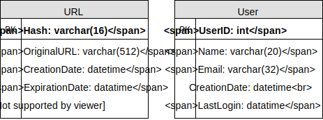

# URL Shortening Service

### Designing a URL Shortening service like TinyURL
Let's design a URL shortening service like TinyURL. This service will provide short aliases redirecting to long URLs.

Similar services: bit.ly, goo.gl, qlink.me, etc.

Difficulty Level: Easy

## 1. Why do we need URL shortening?
URL shortening is used to create shorter aliases for long URLs. We call these shortened aliases “short links.” Users are redirected to the original URL when they hit these short links. Short links save a lot of space when displayed, printed, messaged, or tweeted. Additionally, users are less likely to mistype shorter URLs.

For example, if we shorten this page through TinyURL:

```
https://www.google.com/search?q=computer+science&oq=computer+science&aqs=chrome..69i57j0j69i59l2j0j69i61l3.11125j0j4&sourceid=chrome&ie=UTF-8
```

We would get:

```
https://tinyurl.com/y7lpl6np
```

The shortened URL is nearly one-third the size of the actual URL.

URL shortening is used for optimizing links across devices, tracking individual links to analyze audience and campaign performance, and hiding affiliated original URLs.

If you haven’t used [tinyurl.com](http://tinyurl.com/) before, please try creating a new shortened URL and spend some time going through the various options their service offers. This will help you a lot in understanding this chapter.

## 2. Requirements and Goals of the System

### 💡 You should always clarify requirements at the beginning of the interview. Be sure to ask questions to find the exact scope of the system that the interviewer has in mind.
Our URL shortening system should meet the following requirements:

### Functional Requirements:
1. Given a URL, our service should generate a shorter and unique alias of it. This is called a short link. This link should be short enough to be easily copied and pasted into applications.
2. When users access a short link, our service should redirect them to the original link.
3. Users should optionally be able to pick a custom short link for their URL.
4. Links will expire after a standard default timespan. Users should be able to specify the expiration time.

### Non-Functional Requirements:
1. The system should be highly available. This is required because, if our service is down, all the URL redirections will start failing.
2. URL redirection should happen in real-time with minimal latency.
3. Shortened links should not be guessable (not predictable).

### Extended Requirements:
1. Analytics; e.g., how many times a redirection happened?
2. Our service should also be accessible through REST APIs by other services.

## 3. Capacity Estimation and Constraints
Our system will be read-heavy. There will be lots of redirection requests compared to new URL shortenings. Let’s assume a 100:1 ratio between read and write.

**Traffic estimates**: Assuming, we will have 500M new URL shortenings per month, with 100:1 read/write ratio, we can expect 50B redirections during the same period:

### <div align="center">100 * 500M => 50B</div>

What would be Queries Per Second (QPS) for our system? New URLs shortenings per second:

### <div align="center">500 million / (30 days * 24 hours * 3600 seconds) = ~200 URLs/s</div>

Considering 100:1 read/write ratio, URLs redirections per second will be:

### <div align="center">100 * 200 URLs/s = 20K/s</div>

**Storage estimates**: Let’s assume we store every URL shortening request (and associated shortened link) for 5 years. Since we expect to have 500M new URLs every month, the total number of objects we expect to store will be 30 billion:

### <div align="center">500 million * 5 years * 12 months = 30 billion</div>

Let’s assume that each stored object will be approximately 500 bytes (just a ballpark estimate–we will dig into it later). We will need 15TB of total storage:

### <div align="center">30 billion * 500 bytes = 15 TB</div>

|   |   |
|---|---|
|URL Shortenings per month | 500 million|
|Total years | 5|
|URL object size | 500 Bytes|
|Total Files | 30 billion|
|Total Storage | 15 TB|

**Bandwidth estimates**: For write requests, since we expect 200 new URLs every second, total incoming data for our service will be 100KB per second:

### <div align="center">200 * 500 bytes = 100 KB/s</div>

For read requests, since every second we expect ~20K URLs redirections, total outgoing data for our service would be 10MB per second:

### <div align="center">20K * 500 bytes = ~10 MB/s</div>

**Memory estimates**: If we want to cache some of the hot URLs that are frequently accessed, how much memory will we need to store them? If we follow the 80-20 rule, meaning 20% of URLs generate 80% of traffic, we would like to cache these 20% hot URLs.

Since we have 20K requests per second, we will be getting 1.7 billion requests per day:

### <div align="center">20K * 3600 seconds * 24 hours = ~1.7 billion</div>

To cache 20% of these requests, we will need 170GB of memory.

### <div align="center">0.2 * 1.7 billion * 500 bytes = ~170GB</div>

One thing to note here is that since there will be a lot of duplicate requests (of the same URL), therefore, our actual memory usage will be less than 170GB.

**High level estimates**: Assuming 500 million new URLs per month and 100:1 read:write ratio, following is the summary of the high level estimates for our service:

|   |   |
|---|---|
|New URLs | 200/s|
|URL redirections | 20K/s|
|Incoming data | 100KB/s|
|Outgoing data | 10MB/s|
|Storage for 5 years | 15TB|
|Memory for cache	| 170GB|

## 4. System APIs
### 💡Once we've finalized the requirements, it's always a good idea to define the system APIs. This should explicitly state what is expected from the system.
We can have SOAP or REST APIs to expose the functionality of our service. Following could be the definitions of the APIs for creating and deleting URLs:

### <div align="center">createURL(api_dev_key, original_url, custom_alias=None, user_name=None, expire_date=None)</div>
**Parameters**:
* api_dev_key (string): The API developer key of a registered account. This will be used to, among other things, throttle users based on their allocated quota.
* original_url (string): Original URL to be shortened.
* custom_alias (string): Optional custom key for the URL.
* user_name (string): Optional user name to be used in the encoding.
* expire_date (string): Optional expiration date for the shortened URL.

**Returns**: (string)
A successful insertion returns the shortened URL; otherwise, it returns an error code.

### <div align="center">deleteURL(api_dev_key, url_key)</div>
Where “url_key” is a string representing the shortened URL to be retrieved. A successful deletion returns ‘URL Removed’.

**How do we detect and prevent abuse?** A malicious user can put us out of business by consuming all URL keys in the current design. To prevent abuse, we can limit users via their api_dev_key. Each api_dev_key can be limited to a certain number of URL creations and redirections per some time period (which may be set to a different duration per developer key).

## 5. Database Design
### 💡Defining the DB schema in the early stages of the interview would help to understand the data flow among various components and later would guide towards data partitioning.
A few observations about the nature of the data we will store:

1. We need to store billions of records.
2. Each object we store is small (less than 1K).
3. There are no relationships between records—other than storing which user created a URL.
4. Our service is read-heavy.

### Database Schema:
We would need two tables: one for storing information about the URL mappings, and one for the user’s data who created the short link.



**What kind of database should we use?** Since we anticipate storing billions of rows, and we don’t need to use relationships between objects – a NoSQL store like [DynamoDB](https://en.wikipedia.org/wiki/Amazon_DynamoDB), [Cassandra](https://en.wikipedia.org/wiki/Apache_Cassandra) or [Riak](https://en.wikipedia.org/wiki/Riak) is a better choice. A NoSQL choice would also be easier to scale. Please see [SQL vs NoSQL](../basics/sql-vs-nosql.md) for more details.

## 6. Basic System Design and Algorithm

## 7. Data Partitioning and Replication
To scale out our DB, we need to partition it so that it can store information about billions of URLs. We need to come up with a partitioning scheme that would divide and store our data into different DB servers.

**a. Range Based Partitioning**: We can store URLs in separate partitions based on the first letter of the hash key. Hence we save all the URLs starting with letter ‘A’ (and ‘a’) in one partition, save those that start with letter ‘B’ in another partition and so on. This approach is called range-based partitioning. We can even combine certain less frequently occurring letters into one database partition. We should come up with a static partitioning scheme so that we can always store/find a URL in a predictable manner.

The main problem with this approach is that it can lead to unbalanced DB servers. For example, we decide to put all URLs starting with letter ‘E’ into a DB partition, but later we realize that we have too many URLs that start with the letter ‘E’.

**b. Hash-Based Partitioning**: In this scheme, we take a hash of the object we are storing. We then calculate which partition to use based upon the hash. In our case, we can take the hash of the ‘key’ or the short link to determine the partition in which we store the data object.

Our hashing function will randomly distribute URLs into different partitions (e.g., our hashing function can always map any ‘key’ to a number between [1…256]), and this number would represent the partition in which we store our object.

This approach can still lead to overloaded partitions, which can be solved by using [Consistent Hashing](../basics/consistent-hashing.md).

## 8. Cache

## 9. Load Balancer (LB)
We can add a Load balancing layer at three places in our system:

1. Between Clients and Application servers
2. Between Application Servers and database servers
3. Between Application Servers and Cache servers

Initially, we could use a simple Round Robin approach that distributes incoming requests equally among backend servers. This LB is simple to implement and does not introduce any overhead. Another benefit of this approach is that if a server is dead, LB will take it out of the rotation and will stop sending any traffic to it.

A problem with Round Robin LB is that we don’t take the server load into consideration. If a server is overloaded or slow, the LB will not stop sending new requests to that server. To handle this, a more intelligent LB solution can be placed that periodically queries the backend server about its load and adjusts traffic based on that.

## 10. Purging or DB cleanup

## 11. Telemetry
How many times a short URL has been used, what were user locations, etc.? How would we store these statistics? If it is part of a DB row that gets updated on each view, what will happen when a popular URL is slammed with a large number of concurrent requests?

Some statistics worth tracking: country of the visitor, date and time of access, web page that refers the click, browser, or platform from where the page was accessed.

## 12. Security and Permissions
Can users create private URLs or allow a particular set of users to access a URL?

We can store the permission level (public/private) with each URL in the database. We can also create a separate table to store UserIDs that have permission to see a specific URL. If a user does not have permission and tries to access a URL, we can send an error (HTTP 401) back. Given that we are storing our data in a NoSQL wide-column database like Cassandra, the key for the table storing permissions would be the ‘Hash’ (or the KGS generated ‘key’). The columns will store the UserIDs of those users that have the permission to see the URL.


## Summary

<details>
  <summary>Expand</summary>


## Requirements
- Functional Requirements
  - Given a URL, generate a shorter and unique alias (short link).
  - When users access a short link, redirect to the original link.
  - Users should optionally be able to pick a custom short link for their URL.
  - Links will expire after a standard default timespan. Users should also be able to specify the expiration time.

- Non-Functional Requirements
  - The system should be highly available. This is required because, if our service is down, all the URL redirections will start failing.
  - URL redirection should happen in real-time with minimal latency.
  - Shortened links should not be guessable (not predictable).

- Extended Requirements
  - Analytics; e.g., how many times a redirection happened?
  - Be accessible through REST APIs by other services.

## Capacity Estimation and Constraints
- Assumption
  - Read-heavy. More redirection requests compared to new URL shortenings.
  - Assume **100:1** ratio between read and write.

- Traffic estimates
  - **500M** new URL shortenings per month, 100 * 500M => 50B redirections per month.
  - New URL shortenings per second
    - 500 million / (30 days * 24 hours * 3600 seconds) = **~200 URLs/s**
  - URLs redirections per second
    - 50 billion / (30 days * 24 hours * 3600 sec) = **~19K/s**

- Storage estimates
  - Assume storing every URL shortening request for 5 years, each object takes **500 bytes**
  - Total objects: 500 million * 5 years * 12 months = **30 billion**
  - Total storage: 30 billion * 500 bytes = **15 TB**

- Bandwidth estimates
  - Write: 200 URL/s * 500 bytes/URL = **100 KB/s**
  - Read: 19K URL/s * 500 bytes/URL = **~9 MB/s**

- Cache memory estimates
  - Follow the 80-20 rule, assuming 20% of URLs generate 80% of traffic, cache 20% hot URLs
  - Requests per day: 19K * 3600 seconds * 24 hours = **~1.7 billion/day**
  - Cache 20%: 0.2 * 1.7 billion * 500 bytes = **~170GB**

- Summary
  - Assuming 500 million new URLs per month and 100:1 read:write ratio
  Category | Calculation | Estimate
  ---- | ---- | ----
  New URLs | 500 million / (30 days * 24 hours * 3600 seconds) | 200 /s
  URL redirections | 500 million * 100 / (30 days * 24 hours * 3600 seconds) | 19 K/s
  Incoming data | 500 bytes/URL * 200 URL/s | 100 KB/s
  Outgoing data | 500 bytes/URL * 19K URL/s | 9 MB/s
  Storage for 5 years | 500 bytes/URL * 500 million * 60 months | 15 TB
  Memory for cache | 19K URL * 3600 seconds * 24 hours * 500 bytes * 20% | 170 GB

## System APIs
### `createUrl`
- Parameters
  Name | Type | Note
  ---- | ---- | ----
  `api_dev_key` | `string` | The API developer key of a registered account. This will be used to, among other things, throttle users based on their allocated quota.
  `original_url` | `string` | Original URL to be shortened.
  `custom_alias` | `string` | Optional custom key for the URL.
  `user_name` | `string` | Optional user name to be used in encoding.
  `expire_date` | `string` | Optional expiration date for the shortened URL.
- Return
  - `string`
  - A successful insertion returns the shortened URL; otherwise, it returns an error code.

### `deleteUrl`
- Parameters
  Name | Type | Note
  ---- | ---- | ----
  `api_dev_key` | `string` | The API developer key of a registered account. This will be used to, among other things, throttle users based on their allocated quota.
  `url_key` | `string` | Short URL.
- Return
  - `string`
  - A successful deletion returns ‘URL Removed’.

## Database design
- Observations
  - Need to store billions of records.
  - Each object is small (less than 1K).
  - No relationships between records—other than storing which user created a URL.
  - Read-heavy.
  - A [NoSQL](../basics/sql-vs-nosql.md) choice would also be easier to scale.
  - Comment: SQL with sharding should also work

- Schema
  - URL
    Column | Type
    ---- | ----
    `hash` | varchar(16)
    `original_url` | varchar(512)
    `creation_date` | datetime
    `expiration_date` | datetime
    `user_id` | int
  - User
    Column | Type
    ---- | ----
    `name` | varchar(20)
    `email` | varchar(32)
    `creation_date` | datetime
    `last_login` | datetime

## Basic System Design and Algorithm
### Encoding actual URL
- Compute unique hash
  - `base64`: A-Z, a-z, 0-9, `-`, `.`
  - 6 letters: 64 ^ 6 = ~68.7 billion
  - 8 letters: 64 ^ 8 = ~281 trillion
  - Use 6 letters
  - `MD5` generates 128 bit hash value
  - Each `base64` character encodes 6 bits
  - `base64` encoding generates 22 characters
  - Select 8 characters
- Issues with this approach
  - Same URL from multiple users
  - URL-encoded
- Workaround
  - Append an increasing sequence number to each input URL, and generate a hash for it
  - Append user id to input URL

### Generating keys offline
- Standalone Key Generation Service (KGS)
  - Generate random 6 letter strings and store them in a database (key DB)
  - When a short URL is needed, take one from the key DB

- Key DB size
  - 6 characters/key * 68.7B unique keys = 412 GB

- Concurrency issue
  - If there are multiple servers reading keys concurrently, two or more servers try to read the same key from the database.

- Workaround
  - Servers can use KGS to read/mark keys in the database.
  - KGS can use two tables to store keys: one for keys that are not used yet, and one for all the used keys.
  - KGS can always keep some keys in memory so that it can quickly provide them whenever a server needs them.
  - KGS needs to make sure not to give the same key to multiple servers.
  - Comment: keys are sharded. Each KGS server only serves one application server.

- Key lookup
  - When a key is found, issue an "HTTP 302 Redirect" status and passing the stored URL.
  - When a key is not found, issue an "HTTP 404 Not Found", or redirect to homepage.

### UUID
Replace KGS with UUID.

## Data Partitioning and Replication
- Range Based Partitioning
  - Store URLs in separate partitions based on the first letter of the URL or the hash key.
  - Combine certain less frequently occurring letters into one database partition.
- Problem with this approach
  - Unbalanced servers.

- Hash-Based Partitioning
  - Take a hash of the short URL we are storing, and calculate which partition to use based upon the hash.
  - Use [consistent hashing](../basics/consistent-hashing.md)

## Cache
- Eviction policy
  - LRU: discard the least recently used URL first
- Cache update
  - Cache miss: hit backend database and pass new entry to all cache replicas

## Load Balancer (LB)
- LB locations
  - Between Clients and Application servers
  - Between Application Servers and database servers
  - Between Application Servers and Cache servers

## DB Sweeping
A separate Cleanup service can run periodically to remove expired links from our storage and cache.

## Telemetry
Statistics about the system: how many times a short URL has been used

## Security and Permissions
- Store permission level (public/private) with each URL in the database
- Send an error (HTTP 401) for unauthorized access

</details>
